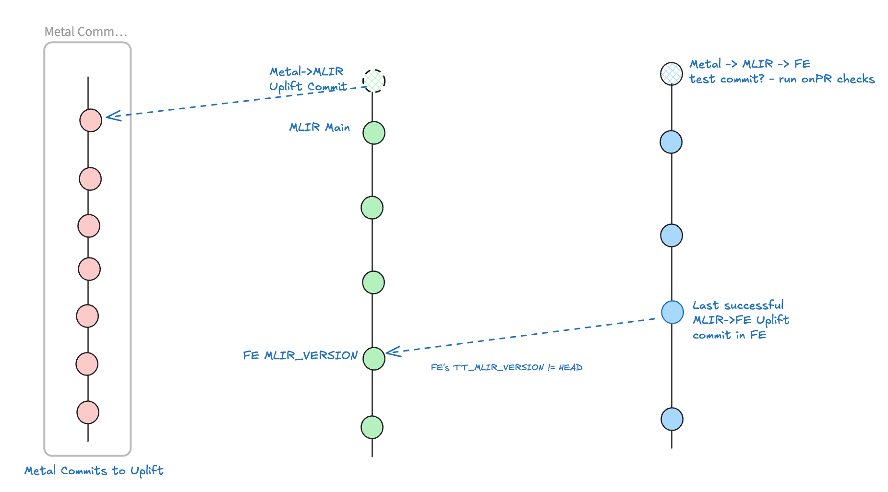
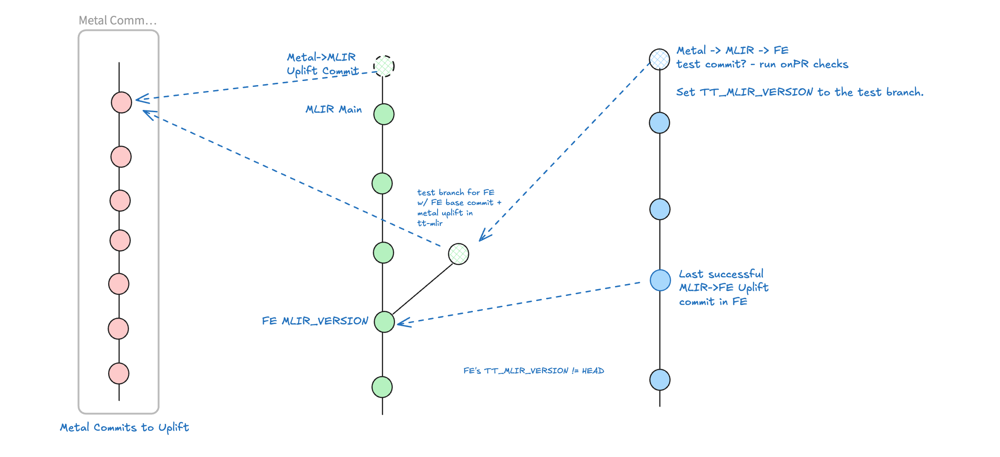

# fe_base_commits.py

## Overview

This tool shows the base MLIR commit for each FE: tt-torch, tt-xla and tt-forge-fe. This is whatever MLIR commit the FE is currently using, set via submodule tag in forge-fe or hardcoded into the third_party/CMakeLists.txt for tt-xla. FEs try to keep up to date with MLIR main, but sometimes for various reasons they are not up to date.

When qualifying metal uplifts against FEs, we want to check just the metal commits in isolation. This means we need to generate a test commit in the FE (see top-right blue dot.) This is because there is a chance that a tt-mlir commit between where the FE is currently, and tt-mlir HEAD, might cause an issue in the FE. For example, a function signature change in tt-mlir that breaks the build of the FE.


*This image asks - which tt-mlir commit should the FE uplift point to?*

To avoid such unrelated issues in MLIR breaking the FE in ways unrelated to the metal commit, the process of validating FEs is as follows:
1. Create a branch of mlir for the FE test, rooted at the FE's current tt-mlir base commit
2. Cherry pick the metal->mlir uplift commit, in MLIR, onto the test branch. This should only change the TT_METAL_VERSION in tt-mlir, and apply whatever patches are necessary in tt-mlir to make the tt-metal uplift work (eg. op interface patches, CPMCache, etc)
3. Point the FE's MLIR VERSION to the HEAD of the test branch in MLIR and run onPR

*Note* If the FEs are far enough behind in MLIR that there are other tt-metal->mlir uplift commits between the FE's mlir base commit and mlir head, those uplift commits must be cherry picked in order on the test branch too, and the new uplift cherry picked on top. This can be complicated, feel free to ask for help in in situations like this. FEs try to keep up to date in tt-mlir so this should be rare.


*This image shows the test branch architecture.*

## Usage

Run ` python show/fe_base_commits.py`. It takes no arguments, and clones FEs and mlir into your cwd, or pulls if the repo already exists. This may take a while.

*Note* It is recommended to run this from a tools folder, since it will fetch changes to a local repo if it's in your tree.

## Examples

Produces output in a table.
```
Example output:
repo name                      | tt-xla commit                            | tt-mlir commit                           | ttmlir commit details
------------------------------------------------------------------------------------------------------------------------------------------------------
tt-torch (using tt-xla mlir)   | 90c981f6b0547ad7819ac60aca64fce4e82c2e3c | c659dddd8240ea85202c789aa2a886992ec66c44 | c659dddd8 | Marina Vasiljevic | 2025-09-01 17:46:06 +0200 | Enable convolution bias fusing when input is broadcasted (#4732)
tt-xla                         | N/A                                      | 8f318886f6cb299a753f5dff1bbf0e5083c4dfd5 | 8f318886f | Tapasvi Patel | 2025-09-06 17:01:42 -0500 | Remove shardy roundtrip patch due to jax0.7 uplift (#4816)
tt-forge-fe                    | N/A                                      | 17e1c32cd023ab1541ae56a8cdf9c6cb715e130e | 17e1c32cd | Saber Gholami | 2025-09-02 17:25:39 -0400 | [Optimizer] Add constraint API for memory management ops (#4734)
```

The relevant column is the `tt-mlir commit` and details column, which give the base commit.

The tt-xla commit is specific to tt-torch, since tt-torch consumes tt-mlir via tt-xla usually rather than setting its own tt-mlir commit. (however this is fine for verification.)

