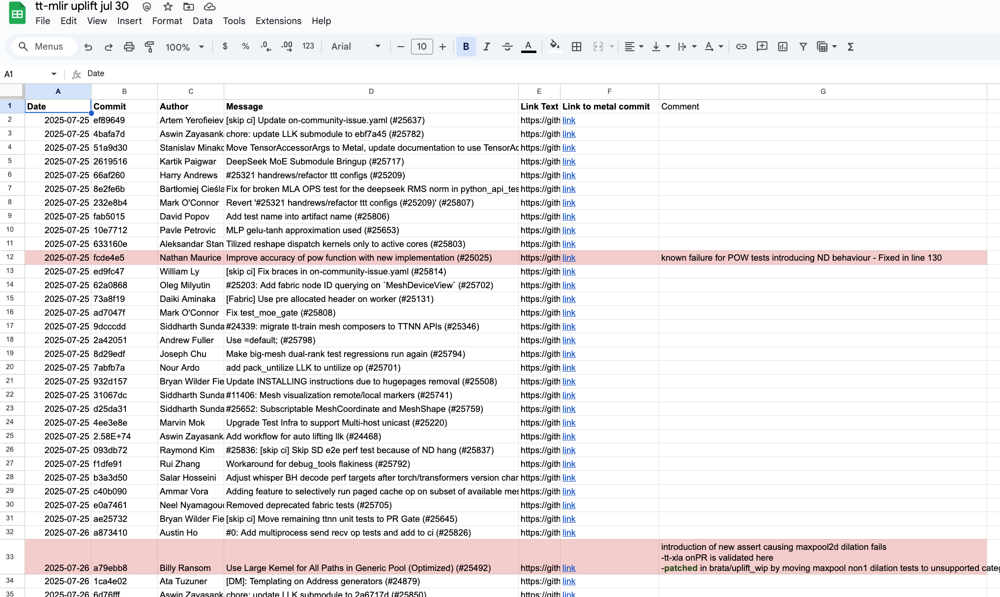

# metal_commit_range.py

## Overview

The metal commit range tool is a simple wrapper around git log, which helps extract out a git log for metal commits in CSV format exportable to google sheets or excel.

## Usage

```
./metal_commit_range.py <from_commit> <to_commit>
```

## Examples

```
% show/metal_commit_range.py HEAD~10 HEAD

Date,Commit,Author,Message,Link
2025-09-16,5e72906,Pavle Petrovic,"Gemma3 multi image test is not on by default (#28609)",https://github.com/tenstorrent/tt-metal/commit/5e7290675d3882abc93cf3b6ddeffbd030b349bd
2025-09-16,1841a5e,Colman Glagovich,"Fix SDPA matmul blocking for short q chunks (#28605)",https://github.com/tenstorrent/tt-metal/commit/1841a5e63113331204e8e28f633ef60b532aaee3
2025-09-16,24bee15,David Popov,"[skip ci] Remove dev tags from setuptool-scm recgonition (#28616)",https://github.com/tenstorrent/tt-metal/commit/24bee151ae54af185532383096fcb3c3a0371a75
2025-09-16,3e0375b,Ambrose Ling,"Update perf targets for model perf and AGMM (#28278)",https://github.com/tenstorrent/tt-metal/commit/3e0375b101c6952677d8c5864f48b0f0836d9289
2025-09-16,a912a36,Andrew Fuller,"[skip ci] Do not re-package Protobuf. Distros provide it. (#28566)",https://github.com/tenstorrent/tt-metal/commit/a912a3636b17d5d267d680e95e78ce0a23850912
2025-09-16,7cf1d7e,Sicheng Zhou,"Add support for Mixtral8x7B in TT-Transformers (#28210)",https://github.com/tenstorrent/tt-metal/commit/7cf1d7ed7c9b1529d11e846ae97454bd85a7274e
2025-09-16,5c9cc19,Slavko Krstic,"Enable convert_to_chw tests on BH (#28612)",https://github.com/tenstorrent/tt-metal/commit/5c9cc19fff39ee09f6a6071e73f73189c7b24ff3
2025-09-16,bf41668,Maksim Tsishkouski,"Make HF_MODEL work with single-card tests (#27789)",https://github.com/tenstorrent/tt-metal/commit/bf416681da0fc8ca1989bfe70074a3a543fda8b5
2025-09-16,e4f4c9b,William Ly,"[skip ci] Run bh multicard demo tests on VM runners for now since the one BM runner is OOS (#28624)",https://github.com/tenstorrent/tt-metal/commit/e4f4c9bffb3edfa4ef0388222b9c6e450d8a44af
2025-09-16,459da58,Abhishek Agarwal,"[Fabric] Expand stability suite (#28577)",https://github.com/tenstorrent/tt-metal/commit/459da58f0e61a2c09f2645631fadc309f2faf8e8
Diff written to diff_from_HEAD~10_to_HEAD.diff
```

1. Copy-paste the contents of the CSV (everything before "Diff written to") into google sheets
2. Data > Split Text to Columns
3. Insert Hyperlinks by adding =HYPERLINK(<CELL>) just past the rightmost column and copy it down. Unfortunately google sheets doesn't link the "Link" column automatically from step(2) 
4. (Extra) If interested, the `.diff` file shows the literal diff (eg. result of git show on every commit) between the FROM and TO commits. This could be pasted into a chatbot/searched if a particular error signature is to be isolated, though this file can get quite large.



*See output example above.* This format is useful for tracking issues and collaboration.