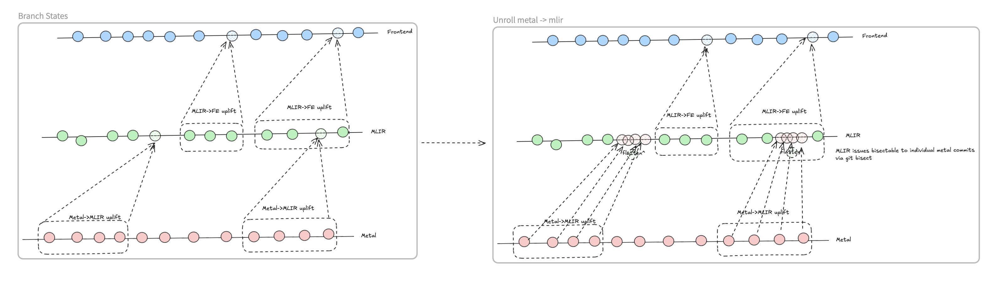

# metal_to_mlir.sh

## Overview

Automates creating a bisectable sequence of commits in the current repo by iterating through a tt-metal commit range and updating `third_party/CMakeLists.txt` to set `TT_METAL_VERSION` for each metal commit. Optionally, for each metal commit, it cherry-picks a corresponding MLIR patch commit when provided via `--patches`.

- Metal repo assumed at: `third_party/tt-metal/src/tt-metal`
- Creates a new branch named like: `$USER/up_bisect_YYYY_MM_DD_<rand>`
- Pushes the branch by default to `origin` (unless `--local-only`)



## Usage

Arguments:

- `<tt-metal-range>`: metal commit range in `abc..def` form. Left must be an ancestor of right. Endpoints can be SHAs or refs; the script will fetch from `origin` if needed.

Options:

- `-v`, `--verbose`: Verbose logging
- `-l`, `--local-only`: Do not push the new branch to `origin`
- `-p`, `--patches <PATCH_RANGE>`: MLIR patch commit range `left..right`. Each patch commit message must end with a metal SHA (short or full); that SHA is mapped to the patch commit and cherry-picked alongside the corresponding metal update commit
- `-h`, `--help`: Show help and exit

## Examples

- From given metal commits 2a1b3c4..deadbeef:

```bash
./map/metal_to_mlir.sh 2a1b3c4..deadbeef
```

- Optionally, provide a patch range to cherry-pick corresponding MLIR fixes:

```bash
# Patch commit message titles should end with a metal SHA (at least first 5 chars of full sha)
./map/metal_to_mlir.sh -p 111aaa..999fff 1a2b3c4..5d6e7f8
# where patch commit message looks like: "Add support for metal commit 111aab"
# TODO: Visualize this better 
```

- Start bisecting with the printed range (as instructed by the script):

```bash
git bisect start <new_range_end> <new_range_start> && git bisect run bash up/check_commit.sh
```
